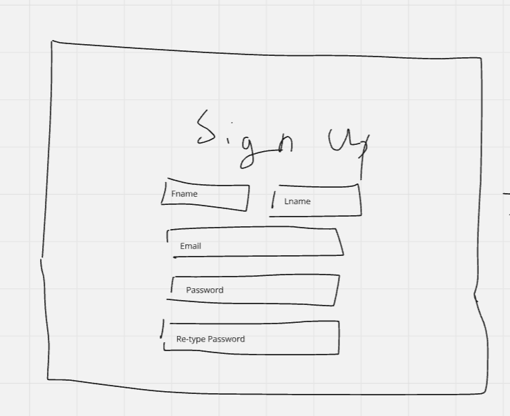
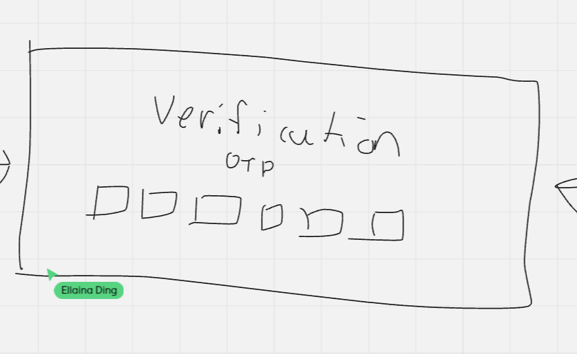
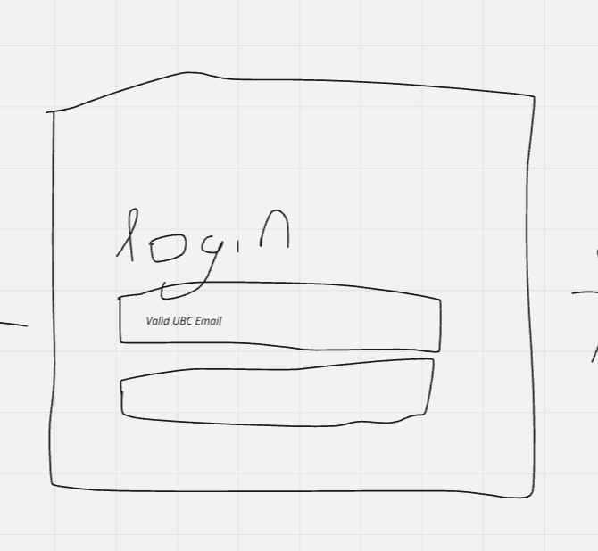
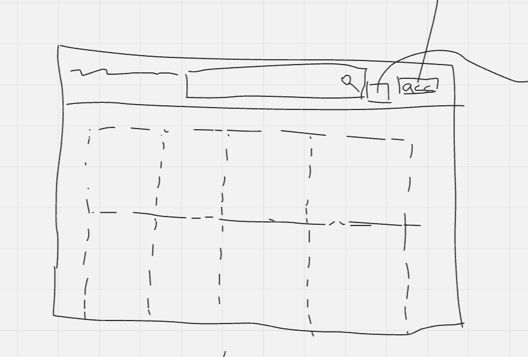
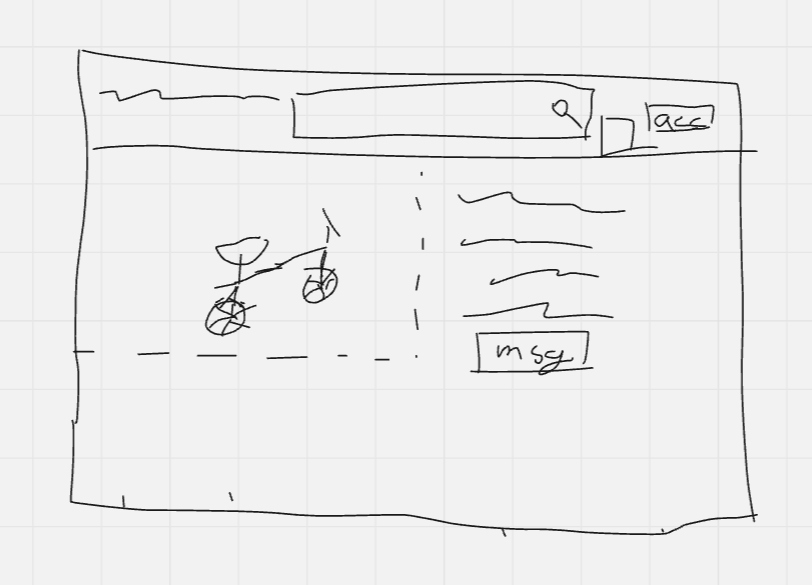
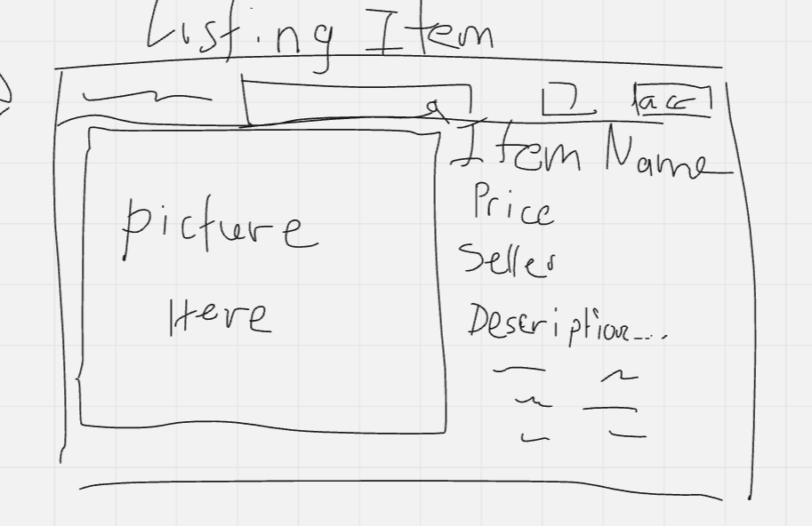
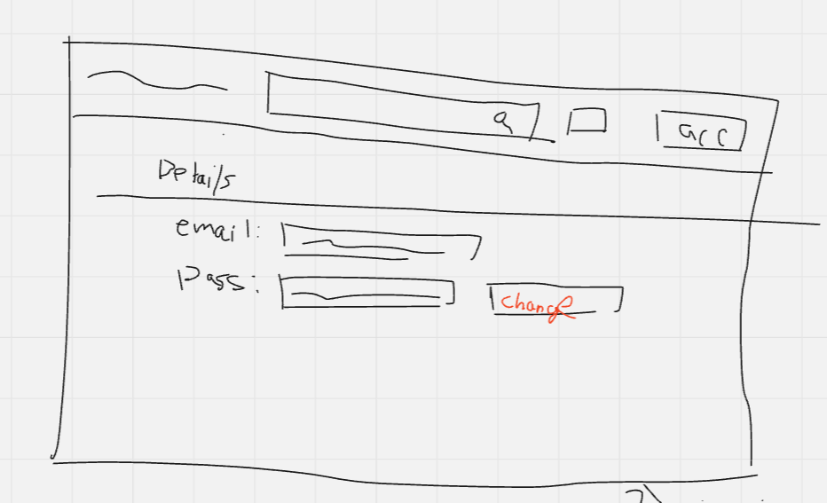

# The Problem
Second-hand marketplaces, while extremely useful 
and convenient, can also be very risky to use. 
Many online marketplaces suffer from shady 
transactions, and fraudulent activity is hard to 
prevent. For example, Facebook Marketplace is a 
popular website where large numbers of transactions
take place each day. However, scamming is easy on 
Facebook Marketplace. Sellers may sell defective 
equipment, they might request advance payments and
then not show up, and the worst part? They can just
create a new account once they get caught.

# The Solution
We propose a second-hand market application that 
only UBC students, faculty, and staff can access.
We will require a valid ubc email address to be
able to make an account to ensure the verification
of each individual. This will reduce the number 
of fake/scam listings on the site as well as 
centralize meetups and transactions to the UBC 
campus. While it is still possible for scammers 
to exist on the platform, it will be much easier
to figure out who the perpetrator is because their
account is linked to their student email.

The design is relatively simple. We begin by 
creating an account for the user. They have to 
input their name, UBC student email, and their
password. Once they have completed this step,
we move on to the verification page

The verification is a simple one-time password 
sent to the email address If the correct OTP is 
given, then an account is created for them.

The login page is also simple, requiring only the
email and password to be given access to the rest 
of the platform.

Once the user logs in, they land on the home page.
In this page, the user can see every listing sorted
by the listing date. Since there are only around
70,000 students, faculty, and staff at UBC, the 
volume of new listings every day will not be very
high, which is why we can display all listings upon
loading the home page. The user can then search 
for specific listings using keywords or tags, if
the listing name (or description?) matches the
search, then the listing will be displayed.

The user can also view a listing in more detail
by clicking on the listing name to show listing
information including name, picture, price, 
seller description and listing description.

Users can create a new public listing. The user 
will be required to fill in all relevant fields
such as a name, price, description, and picture.
The user can also add relevant tags to their
listings, such as “Textbooks”, 
“Furniture/Appliances”, “Clothing” etc. After 
selecting “post”, the user’s new listing will
be added to the home page. Users may then also
edit their own postings.

The user can also navigate to the profile page.
Here, they will be able to view the UBC email 
associated with their account and their set 
password. They will have the option to change 
their password.

#### Screens/Pages
- Sign up: user enters valid UBC email address
- Verification: verification code sent to email
- Login: user enters their UBC email & password
- Home page: has all listings sorted by recency, includes a search bar
- View a listing: includes listing information including name, picture, price, seller description and listing description, has a “message” button to prompt an email to the seller
- Post a listing: user enters listing information including name, picture, price, seller description and listing description
- Edit a listing: original seller can edit listing information including name, picture, price, seller description and listing description, or close listing
- Account page: view account details (email, password), allows user to change password

#### Errors:
- Login/signup
  - Sign up
    - Invalid email (not ending in @ubc.ca)
    - Password reqs
    - Already registered
    - Passwords do not match
  - Login
    - Invalid email and password combination
  - Search for listings
    - “No Listings Found” if search criteria does not match any current active listings
  - Post a listing:
    - Price out of range (price listed < 0)
    - Empty item information fields

#### Algorithms:
- Search algorithm:
  - Features (NLP):
    - Synonym recognition: Understanding different words with similar meanings
    - Spell correction: Correcting typos and misspellings.
  - Discover:
    - Keep an ordered list by date sorted by latest 

